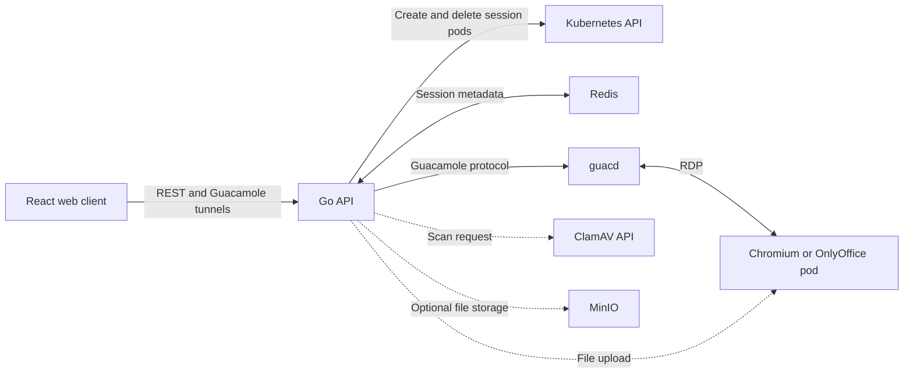

# KubeBrowse

KubeBrowse is a work-in-progress platform for running browser and office-document sessions in Kubernetes. A React web client connects to remote Chromium or OnlyOffice environments through Apache Guacamole, so websites and documents execute in session containers rather than on the user's desktop.

The project combines session provisioning, remote interaction, file uploads, and cleanup in an inspectable prototype. Its security and performance depend on the container images, cluster configuration, and supporting services used in a deployment.

## Current capabilities

- **Browser and document sessions:** separate Kubernetes pods for Chromium and OnlyOffice, with CPU and memory requests and limits.
- **Web client:** remote display and input through Guacamole over WebSocket, with an HTTP tunnel implementation also available.
- **Session controls:** creation, reconnection, sharing, remaining-time checks, timeout extension, and explicit stop requests. Redis holds session metadata; active tunnels are also tracked in the API process.
- **File handling:** uploads to the selected session, ClamAV scan results, and optional MinIO object storage. The API accepts files up to 100 MiB; downstream services may impose lower limits.
- **Cleanup:** background monitoring of registered sessions attempts to close tunnels, delete pods, and remove Redis metadata when sessions expire.
- **Development and observability:** Kubernetes manifests, a Tilt workflow, Swagger documentation, and WebSocket metrics endpoints. Separate manifests provide HPA and Istio ingress configuration.

## How it works



1. The client requests a browser or office session. The API creates a pod and waits for pod readiness and RDP connectivity.
2. The API stores connection metadata in Redis and returns a connection ID. The client uses that ID to open a Guacamole tunnel through the Go API and `guacd`.
3. Files are forwarded to the session's upload service. ClamAV scanning and optional MinIO storage return separate results to the client.
4. Stop requests and expiry monitoring initiate session cleanup. Pod deletion is asynchronous and may fail; an API response alone does not confirm that all resources have been removed.

The implementation entry points are [session handlers](api/main.go), [pod creation](internal/k8s/), [tunnel handling](api/tunnel.go), [file uploads](api/uploads.go), and [session cleanup](internal/cleanup/session_cleanup.go).

## Scope and limitations

- **Containment:** separate pods move application execution away from the endpoint, but containers share the node kernel. The supplied manifests contain no Kubernetes `NetworkPolicy` objects, and the sandbox container security-context blocks are commented out. Strict tenant or network isolation requires additional deployment controls and validation.
- **Scanning:** ClamAV results are advisory. Files are forwarded and opened before, or alongside, scanning; a clean verdict does not gate delivery. A completed scan request does not mean a file is safe.
- **Retention:** deleting a session pod does not delete MinIO objects, database records, client-side session metadata, or external logs. Retention must be handled separately for each service.
- **Access control:** the current server entry point does not attach authentication middleware to session routes, and the WebSocket origin check accepts all origins. Account-related code and PostgreSQL schemas exist in the repository, but they do not establish access control for this session flow.
- **Scale and evaluation:** `/sessions/` reports the serving API process's tunnel store, rather than a cluster-wide user count. HPA manifests scale supporting deployments; session pods are created by API requests. Multi-region session placement, concurrent-user capacity, interactive latency, and malware-detection accuracy are not established by this codebase.

Chrome extension attachment imports, VirusTotal integration, and Firejail hardening are not implemented in this source tree. The externally built sandbox images need their own inspection before attributing additional security controls to them.

## Local development

You need Go compatible with [go.mod](go.mod) (Go 1.24, toolchain 1.24.3), Node.js and npm for the frontend, Docker, `kubectl`, Tilt, and a Kubernetes development cluster with storage provisioning and access to the sandbox images.

Review [deployments/manifest.yml](deployments/manifest.yml) before applying it: it contains example credentials and deployment-specific settings. Set the Kubernetes context allowed by [Tiltfile](Tiltfile) to your development cluster. Browser and office images can be overridden with `BROWSER_IMAGE` and `OFFICE_IMAGE` in the API deployment environment.

From the repository root, apply the supporting services and scanner, then start Tilt:

```sh
kubectl apply -f deployments/manifest.yml
kubectl apply -f deployments/clamavd-api.yaml
tilt up
```

Tilt builds the Go API and configures an API port forward at `http://localhost:4567`. The frontend deployment is currently commented out in the manifest, so run the frontend separately in another terminal:

```sh
npm --prefix frontend install
VITE_API_BASE_URL=http://localhost:4567 npm --prefix frontend run dev
```

Open the address printed by Vite. `VITE_API_BASE_URL` supplies the backend origin for REST calls and derives the WebSocket and HTTP tunnel origins; it is also needed at build time when the frontend is hosted separately.

Session creation requires a working Kubernetes connection, Redis, `guacd`, and reachable sandbox pods. Scanning requires the ClamAV API. MinIO storage is optional. The current Tilt configuration leaves PostgreSQL and Redis resources with `auto_init=False`; ensure the services required by your workflow are running. Docker Compose alone does not supply the Kubernetes cluster needed to create sessions.

See the [contribution guide](docs/CONTRIBUTING.md) and [Tilt development guide](docs/TiltDevelopment.md) for additional context. Some older examples describe previous deployment layouts; use the current manifests, Tiltfile, and frontend configuration when they differ.

## API overview

| Method | Route | Purpose |
| --- | --- | --- |
| POST | `/api/v1/sessions/browser` | Create a browser session |
| POST | `/api/v1/sessions/office` | Create an office session |
| GET | `/api/v1/sessions/:connectionID/connect` | Retrieve the tunnel URL |
| GET | `/api/v1/sessions/:connectionID/share` | Enable session sharing |
| GET | `/websocket-tunnel?uuid=:connectionID` | Open the display WebSocket |
| POST | `/sessions/:connectionID/upload` | Upload a file and collect service results |
| GET | `/sessions/:connectionID/time-left` | Check remaining session time |
| POST | `/sessions/:connectionID/extend` | Request a timeout extension |
| DELETE | `/sessions/:connectionID/stop` | Request session termination |

Swagger UI is served at `/swagger/index.html`. Route registration in [cmd/guac/main.go](cmd/guac/main.go) is the reference for the current endpoints.

## Community and license

Please follow our [Code of Conduct](CODE_OF_CONDUCT.md). See [CONTRIBUTING.md](CONTRIBUTING.md) for contribution guidance and [SECURITY.md](SECURITY.md) for vulnerability reporting.

The repository includes the [GNU General Public License, version 3](LICENSE).
